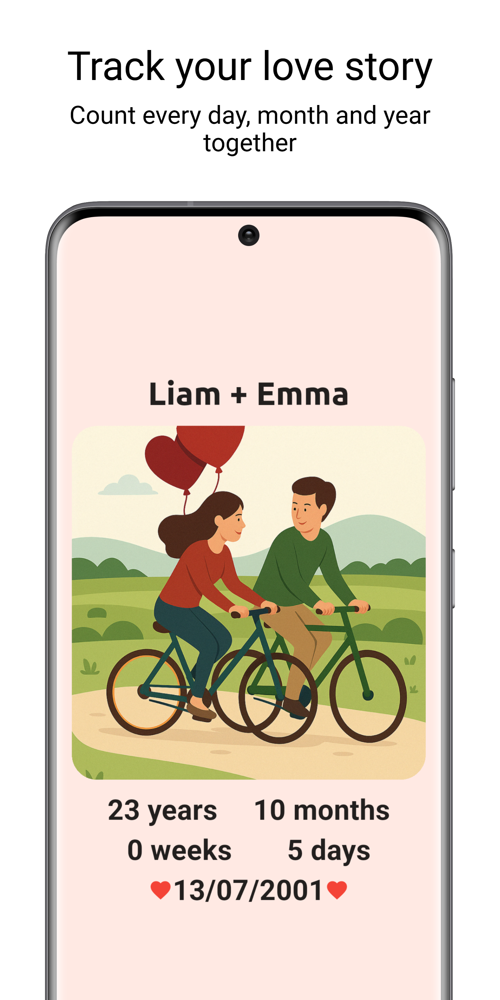
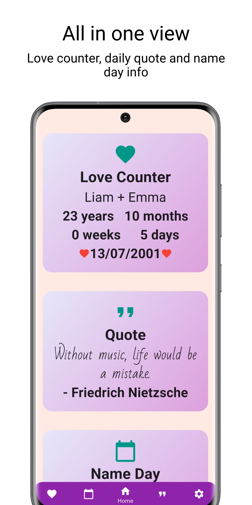
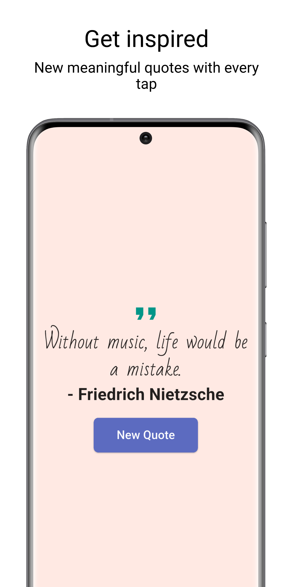
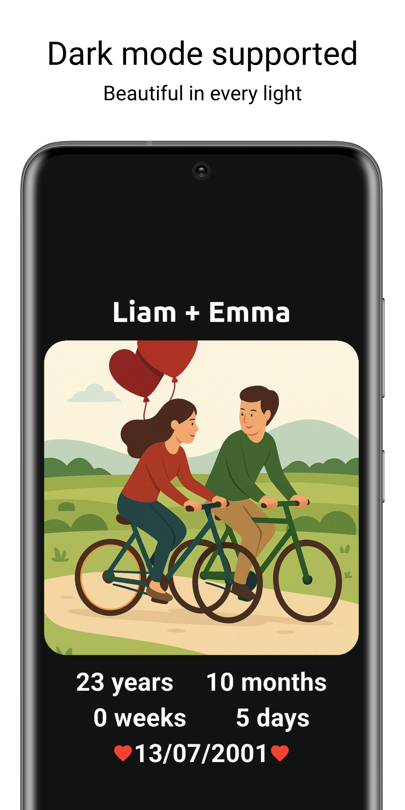
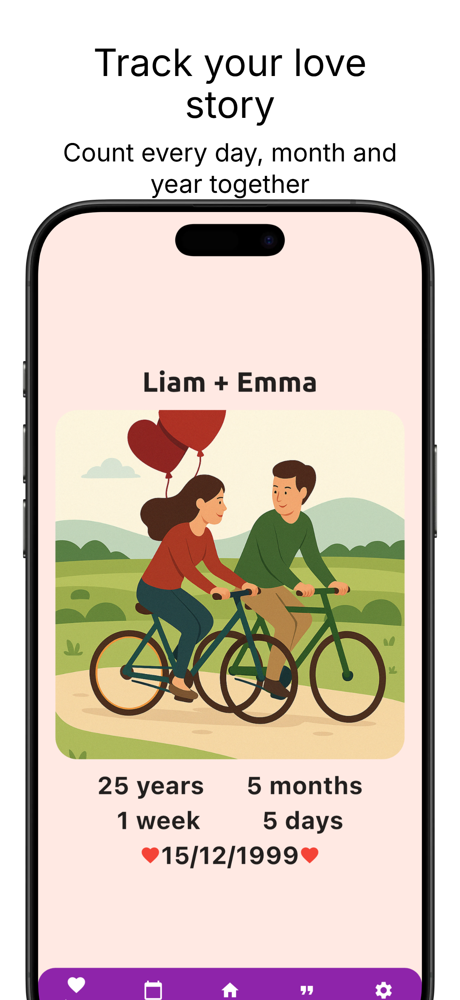
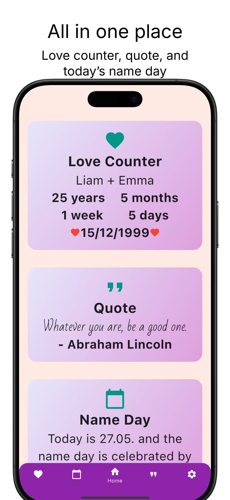
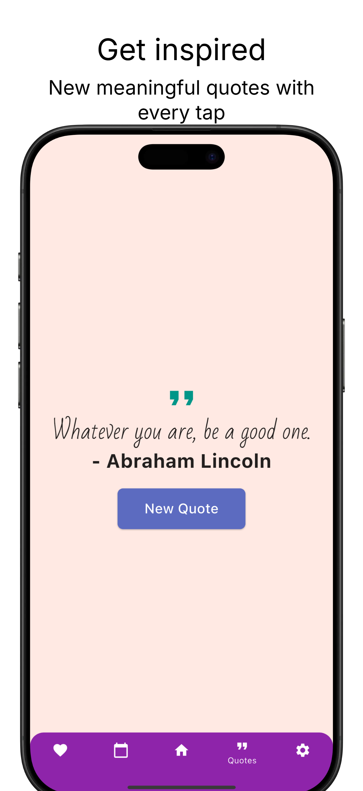
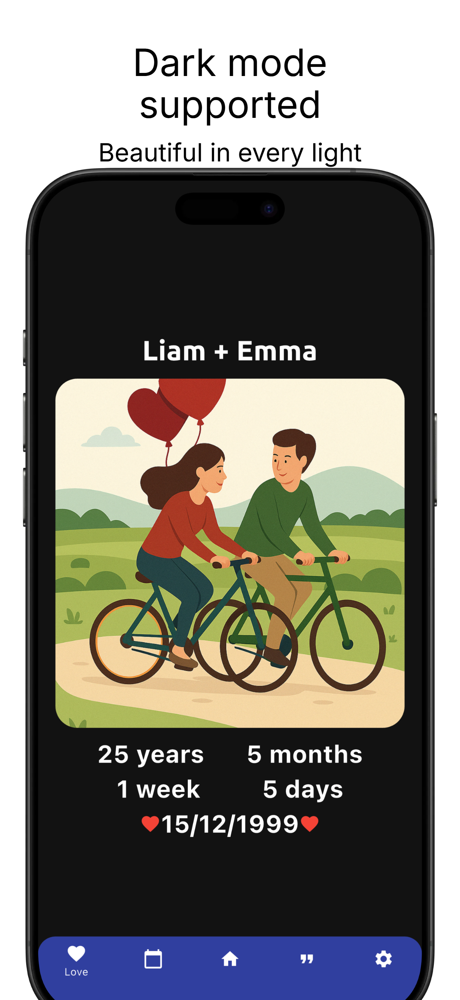

# Couplefy

Couplefy is a Flutter application designed for couples who want to cherish memories, track important shared moments, and
see how long they’ve been together.

## Index

- [Description](#description)
- [Features](#features)
- [Screenshots](#screenshots)
- [Localization](#localization)
- [Getting Started](#getting-started)
- [Project Structure](#project-structure)
- [Built With](#built-with)
- [License](#license)
- [Acknowledgements](#acknowledgements)
- [Other](#other)

## Description

Couplefy helps couples celebrate their relationship by tracking time together, customizing the look of their app, and
even checking name days. With modern visuals, localization support, and useful options, it’s the perfect companion for
romantic milestones.

## Features

* ✅ **Love Counter** – Displays how long you’ve been together in years, months, weeks, and days.
* ❤️ **Date Picker** – Set your relationship start date.
* 🔍 **Display Mode** – Toggle between showing only days or a full breakdown.
* 📸 **Custom Background** – Pick an image from your gallery to personalize the background.
* 📅 **Name Day Calendar** – View name days from Czech calendar.
* 🌐 **Localization** – Supports English and Czech.
* 🌓 **Light and Dark Mode** – Can be changed manually.

## Screenshots

* ### Android

   
<br>
<br>
<br>
<h3><li>Ios</li></h3>
   
<br>
<br>
<br>

## Localization

The app supports:

* **English**
* **Czech**

Localization files are located in `lib/l10n/`.

## Getting Started

1. Clone the repository:

```
git clone https://github.com/Fearplay/couplefy.git
```

2. Navigate to the project directory


3. Install dependencies:

```
flutter pub get
```

4. Run the app:

```
flutter run
```

## Project Structure

```
lib/
|-- data/               # Local datas
|-- l10n/               # Localization files
|-- models/             # Data models
|-- screens/            # Main application screens
|-- theme/              # Color and text style configuration
|-- utils/              # Helper classes and utilities
|-- widgets/            # Reusable components
|-- main.dart           # App entry point
```

## Built With

* [**image_picker**](https://pub.dev/packages/image_picker) - To select background images from the gallery.
* [**flutter_native_splash**](https://pub.dev/packages/flutter_native_splash) - Automatically generates a native splash
  screen for Android and iOS at app startup.
* [**shared_preferences**](https://pub.dev/packages/shared_preferences) - Enables persistent local storage for simple
  data like selected date, names, dark mode preferences, etc.
* [**url_launcher**](https://pub.dev/packages/url_launcher) - Opens external URLs, email apps or maps using the system's
  default apps (used in Support Me link).
* [**app_promo_screenshots**](https://studio.app-mockup.com/) - Helps generate promotional screenshots for the **App
  Store** and **Google Play Store**.

## License

MIT License. See the `LICENSE` file for more details.

## Acknowledgements

This application was built as a personal project to help couples keep track of their journey and shared milestones.
Thank you for using it!

## Other

* If you find any issue, please don't hesitate to report it
  via [Issues](https://github.com/Fearplay/couplefy/issues)
* If you have an idea to improve this app, please don't hesitate to create pull request
  via [Pull requests](https://github.com/Fearplay/couplefy/pulls)

[Back to TOP](#couplefy)
